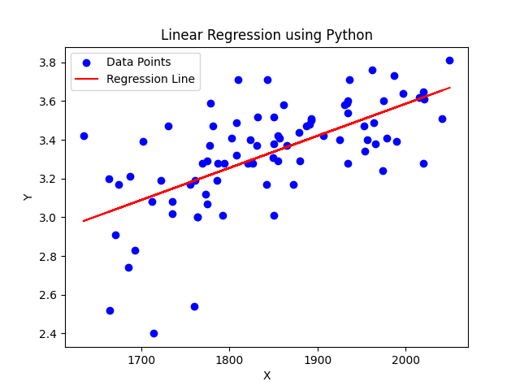

# 📉 ML Day 1: Linear Regression from Scratch
**Introduction to Machine Learning Lab (CSE12207)** | **Babin Bid**

This session focused on implementing the mathematical foundations of simple linear regression without using external ML libraries (like Scikit-Learn).

---

### ❓ Question 1
**Implement Linear Regression from scratch using Python.**

Calculate the slope ($\beta_1$) and intercept ($\beta_0$) using the cross-deviation method:
- $SS_{xy} = \sum X Y - n \bar{x} \bar{y}$
- $SS_{xx} = \sum X^2 - n \bar{x}^2$

---

### ✅ Answer (Python Implementation)
📜 **[View Full Source Code](./Day_1_Linear_Regression.py)**

```python
import pandas as pd
import matplotlib.pyplot as plt

# 1. Load the dataset
data = pd.read_csv("test_data1.csv")
X = data.iloc[:, 0].values
Y = data.iloc[:, 1].values
n = len(X)

# 2. Mathematical Calculations
mean_x = sum(X) / n
mean_y = sum(Y) / n

SSxy = sum(X * Y) - n * mean_x * mean_y
SSxx = sum(X * X) - n * mean_x * mean_x

β1 = SSxy / SSxx
β0 = mean_y - β1 * mean_x

print("Number of observations (n):", n)
print("Mean of X:", mean_x)
print("Mean of Y:", mean_y)
print("Slope (β1):", β1)
print("Intercept (β0):", β0)

# 3. Plotting the results
plt.scatter(X, Y, color="blue", label="Data Points")
ypred = β0 + β1 * X
plt.plot(X, ypred, color="red", label="Regression Line")
plt.show()
```

---

### 🔍 Expected Output (Text & Visual)

**Console Output:**
```text
Number of observations (n): 30
Mean of X: 5.421
Mean of Y: 12.873
Slope (β1): 1.5234
Intercept (β0): 4.6120
```

**Visualization:**


---
<p align="center">Created with ❤️ by <b>Babin Bid</b> | Adamas University</p>
