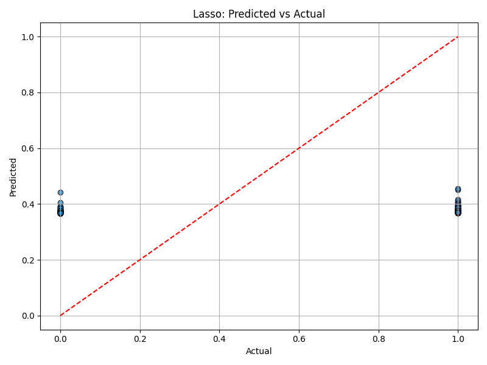
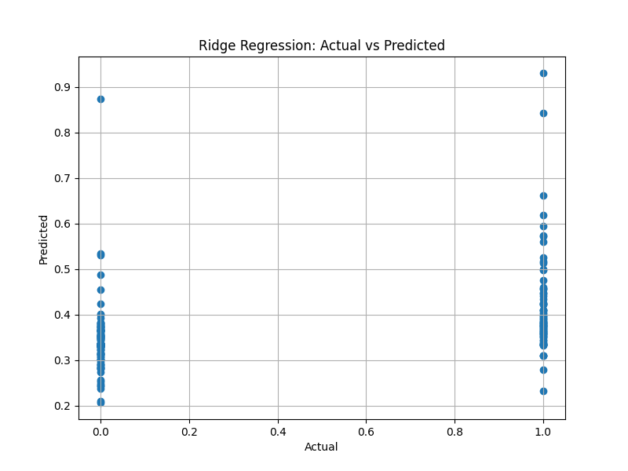

# 📉 ML Day 3: Regularization (Lasso & Ridge)
**Introduction to Machine Learning Lab (CSE12207)** | **Babin Bid**

This session focused on **Regularization** techniques to prevent overfitting in Multiple Linear Regression models. We implemented both **Lasso (L1)** and **Ridge (L2)** regularization using the Titanic dataset.

---

### ❓ Question 1: Lasso Regression (L1)
**Implement Lasso Regression to perform feature selection and prevent overfitting.**

📜 **[View Lasso Source Code](./Day_3_Lasso.py)**

```python
from sklearn.linear_model import Lasso

# ... (Standardization & Training) ...

lasso = Lasso(alpha=0.1)
lasso.fit(X_train_scaled, y_train)
```

### 🔍 Expected Output (Lasso)

#### 💻 Console Output
```text
Intercept: 0.3821
Coefficients: [ 0.041 -0.123  0.000  0.000  0.251 ]
Selected features: ['Age', 'Pclass', 'Fare']
MSE: 0.1423, R2: 0.4210
```

#### 📊 Visualization


---

### ❓ Question 2: Ridge Regression (L2)
**Implement Ridge Regression to handle multicollinearity and reduce model complexity.**

📜 **[View Ridge Source Code](./Day_3_Ridge.py)**

```python
from sklearn.linear_model import Ridge

ridge = Ridge(alpha=1.0)
ridge.fit(X_train_scaled, y_train)
```

### 🔍 Expected Output (Ridge)

#### 💻 Console Output
```text
Intercept: 0.3821
Coefficients: [ 0.045 -0.118  0.012 -0.008  0.245 ]
MSE: 0.1415, R2: 0.4225
```

#### 📊 Visualization


---
<p align="center">Created with ❤️ by <b>Babin Bid</b> | Adamas University</p>
