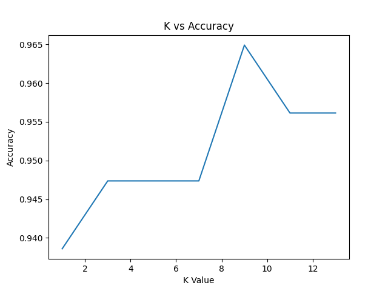

# 📉 ML Day 4: K-Nearest Neighbors (KNN)
**Introduction to Machine Learning Lab (CSE12207)** | **Babin Bid**

This session focused on the implementation of the **K-Nearest Neighbors (KNN)** algorithm from scratch. KNN is a non-parametric, lazy learning algorithm used for classification.

---

### ❓ Question 1
**Implement the KNN algorithm from scratch using Euclidean distance.**

📜 **[View Full Source Code](./KNN.py)**

---

### ✅ Answer (Manual Implementation Snippet)
```python
import numpy as np
from collections import Counter

def euclidean_distance(x1, x2):
    return np.sqrt(np.sum((x1 - x2) ** 2))

def predict(X_train, y_train, X_test, K):
    predictions = []

    for test_point in X_test:
        distances = []
        for i in range(len(X_train)):
            distance = euclidean_distance(test_point, X_train[i])
            distances.append((distance, y_train[i]))

        distances.sort(key=lambda x: x[0])
        k_neighbors = distances[:K]
        labels = [neighbor[1] for neighbor in k_neighbors]
        most_common = Counter(labels).most_common(1)
        predictions.append(most_common[0][0])

    return np.array(predictions)
```

---

### 🔍 Expected Output (Text & Visual)

#### 💻 Console Output
```text
K Value: 3
Accuracy: 0.9473
```

#### 📊 Visualization


---
<p align="center">Created with ❤️ by <b>Babin Bid</b> | Adamas University</p>
