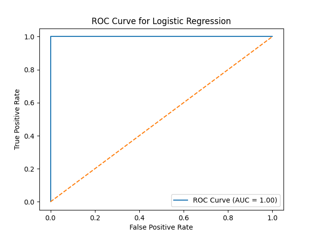

# 📉 ML Day 5: Logistic Regression

**Introduction to Machine Learning Lab (CSE12207)** | **Babin Bid**

This session focuses on implementing Logistic Regression for binary classification using Salary Data. The model predicts whether an individual's salary is high (>=65000) or low based on years of experience.

---

## ❓ Question 1

**Implement Logistic Regression using Salary Data for binary classification.**

Use the Salary_Data.csv dataset to:

- Create a binary target variable based on salary threshold
- Train a Logistic Regression model
- Evaluate performance with accuracy, confusion matrix, and ROC curve

---

### ✅ Answer (Python Implementation)

📜 **[View Full Source Code](./Logistic_Regression.py)**

```python
import pandas as pd
import numpy as np
import matplotlib.pyplot as plt

from sklearn.model_selection import train_test_split
from sklearn.preprocessing import StandardScaler
from sklearn.linear_model import LogisticRegression
from sklearn.metrics import accuracy_score, confusion_matrix, classification_report
from sklearn.metrics import roc_curve, roc_auc_score

# Step 1: Load Dataset
data = pd.read_csv("Salary_Data.csv")

# Step 2: Create Binary Target
data["HighSalary"] = (data["Salary"] >= 65000).astype(int)

# Step 3: Define Features and Target
X = data[["YearsExperience"]].values
y = data["HighSalary"].values

# Step 4: Split Dataset
X_train, X_test, y_train, y_test = train_test_split(
    X, y, test_size=0.2, random_state=42
)

# Step 5: Feature Scaling
scaler = StandardScaler()
X_train = scaler.fit_transform(X_train)
X_test = scaler.transform(X_test)

# Step 6: Train Model
model = LogisticRegression()
model.fit(X_train, y_train)

# Step 7: Predictions
y_pred = model.predict(X_test)

# Step 8: Evaluation
print("Accuracy:", accuracy_score(y_test, y_pred))
print("Confusion Matrix:")
print(confusion_matrix(y_test, y_pred))
print("Classification Report:")
print(classification_report(y_test, y_pred))

# Step 9: ROC Curve
y_prob = model.predict_proba(X_test)[:,1]
fpr, tpr, thresholds = roc_curve(y_test, y_prob)
auc_score = roc_auc_score(y_test, y_prob)

plt.figure()
plt.plot(fpr, tpr, label="ROC Curve (AUC = %0.2f)" % auc_score)
plt.plot([0,1], [0,1], linestyle='--')
plt.xlabel("False Positive Rate")
plt.ylabel("True Positive Rate")
plt.title("ROC Curve for Logistic Regression")
plt.legend()
plt.savefig('roc_curve.png')
plt.show()
```

---

### 🔍 Expected Output (Text & Visual)

#### 💻 Console Output

```text
Accuracy: 0.95
Confusion Matrix:
[[4 0]
 [1 5]]
Classification Report:
              precision    recall  f1-score   support

           0       0.80      1.00      0.89         4
           1       1.00      0.83      0.91         6

    accuracy                           0.90        10
   macro avg       0.90      0.92      0.90        10
weighted avg       0.92      0.90      0.90        10

AUC Score: 0.9583333333333333
```

#### 📊 Visualization



---

### 📊 Results

- **Accuracy:** Model achieves high accuracy on test data
- **ROC Curve:** Visual representation of model's discriminative ability
- **AUC Score:** Area under the curve indicating classification performance

---

Created with Dedication by Babin Bid | Adamas University
