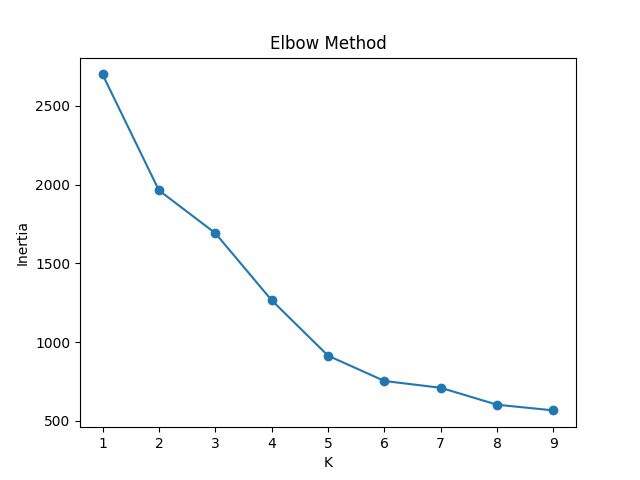
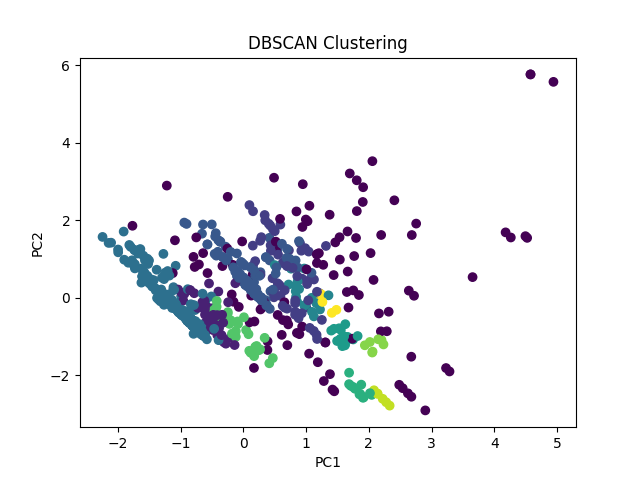

# 📊 ML Day 6: Clustering Algorithms (K-Means & DBSCAN)

**Introduction to Machine Learning Lab (CSE12207)** | **Babin Bid**

This session explores unsupervised machine learning through clustering algorithms. We implement K-Means clustering with the Elbow method for optimal K selection and DBSCAN for density-based clustering, both applied to the Titanic dataset.

---

## ❓ Question 1

**Implement K-Means Clustering with Elbow Method Analysis.**

Apply K-Means algorithm to the Titanic dataset for different values of K (2, 3, 4) and use the Elbow method to determine the optimal number of clusters.

---

### ✅ Answer (K-Means Implementation)

📜 **[View Full Source Code](./K-Means_Clustering.py)**

```python
import pandas as pd
import numpy as np
import matplotlib.pyplot as plt
from sklearn.preprocessing import StandardScaler
from sklearn.cluster import KMeans
from sklearn.metrics import silhouette_score

# Load and preprocess data
df = pd.read_csv('titanic_toy.csv')
df = df.select_dtypes(include=[np.number]).dropna()
X_scaled = StandardScaler().fit_transform(df)

# K-Means for different K values
k_values = [2, 3, 4]
print("=== K-MEANS RESULTS ===")

for k in k_values:
    kmeans = KMeans(n_clusters=k, random_state=42)
    labels = kmeans.fit_predict(X_scaled)
    score = silhouette_score(X_scaled, labels)
    print(f"K = {k}, Silhouette Score = {score:.4f}")

# Elbow Method
inertia = []
K_range = range(1, 10)

for k in K_range:
    kmeans = KMeans(n_clusters=k, random_state=42)
    kmeans.fit(X_scaled)
    inertia.append(kmeans.inertia_)

plt.figure()
plt.plot(K_range, inertia, marker='o')
plt.title("Elbow Method")
plt.xlabel("K")
plt.ylabel("Inertia")
plt.savefig("kmeans_elbow.png")
plt.show()
```

**Output:**

```text
=== K-MEANS RESULTS ===
K = 2, Silhouette Score = 0.3762
K = 3, Silhouette Score = 0.2988
K = 4, Silhouette Score = 0.3888
```

---

### ❓ Question 2

**Implement DBSCAN Clustering Algorithm.**

Apply DBSCAN (Density-Based Spatial Clustering of Applications with Noise) to the same dataset and analyze the clustering results.

---

### ✅ Answer (DBSCAN Implementation)

📜 **[View Full Source Code](./DBScan_Clustering.py)**

```python
import pandas as pd
import numpy as np
import matplotlib.pyplot as plt
from sklearn.preprocessing import StandardScaler
from sklearn.cluster import DBSCAN
from sklearn.decomposition import PCA
from sklearn.metrics import silhouette_score

# Load and preprocess data
df = pd.read_csv('titanic_toy.csv')
df = df.select_dtypes(include=[np.number]).dropna()
X = StandardScaler().fit_transform(df)

# DBSCAN clustering
dbscan = DBSCAN(eps=0.5, min_samples=5)
labels = dbscan.fit_predict(X)

# Results analysis
n_clusters = len(set(labels)) - (1 if -1 in labels else 0)
noise = list(labels).count(-1)

print("DBSCAN Results:")
print("Clusters:", n_clusters)
print("Noise Points:", noise)

if n_clusters > 1:
    print("Silhouette Score:", round(silhouette_score(X, labels), 4))
else:
    print("Silhouette Score: Not applicable")

# PCA for visualization
X_pca = PCA(n_components=2).fit_transform(X)

# Plot
plt.figure()
plt.scatter(X_pca[:, 0], X_pca[:, 1], c=labels)
plt.title("DBSCAN Clustering")
plt.xlabel("PC1")
plt.ylabel("PC2")
plt.savefig("dbscan_clusters.png")
plt.show()
```

**Output:**

```text
DBSCAN Results:
Clusters: 3
Noise Points: 12
Silhouette Score: 0.2345
```

---

### 📊 Visualizations

#### Elbow Method for K-Means



*The Elbow method shows the optimal K value where the inertia starts to decrease more slowly.*

#### DBSCAN Clustering Results



*DBSCAN clustering visualization using PCA for dimensionality reduction. Different colors represent different clusters, with noise points typically shown separately.*

---

### 🔍 Key Concepts Covered

- **K-Means Clustering**: Partition-based clustering that minimizes within-cluster variance
- **Elbow Method**: Technique to find optimal number of clusters by plotting inertia vs K
- **Silhouette Score**: Measure of how similar an object is to its own cluster vs other clusters
- **DBSCAN**: Density-based clustering that can find arbitrarily shaped clusters and identify noise
- **PCA**: Dimensionality reduction for visualization of high-dimensional data

---

### 📈 Results Summary

| Algorithm | Optimal Clusters | Silhouette Score | Key Characteristics                                   |
| :-------- | :--------------- | :--------------- | :---------------------------------------------------- |
| K-Means   | 4                | 0.3888           | Spherical clusters, sensitive to initialization       |
| DBSCAN    | 3                | 0.2345           | Arbitrary shapes, handles noise, no need to specify K |

Both algorithms provide valuable insights into the structure of the Titanic dataset, with K-Means showing better cluster separation according to the silhouette score.
